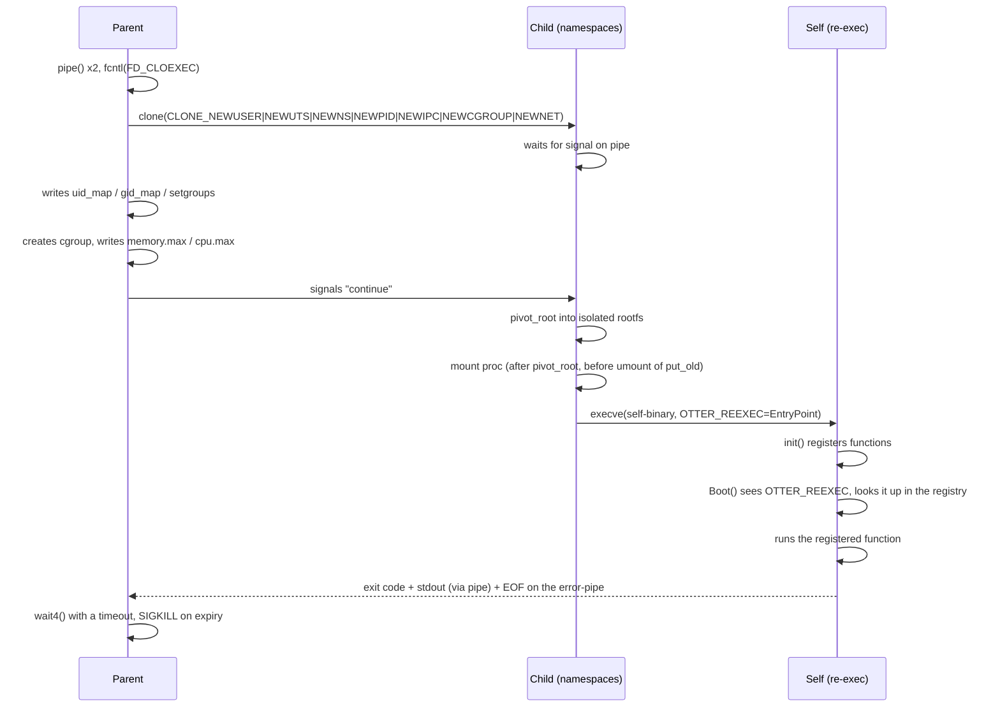

# Otter

A Go library for fine-grained isolation of arbitrary Go code: its own set of namespaces, cgroup limits, wall-clock timeout, and stdout capture — all implemented directly through raw syscalls, without wrappers like `os/exec` or third-party container runtimes.

Otter doesn't wrap Docker and doesn't use `runc` — it does what Docker does under the hood itself: `clone`, `pivot_root`, `mount`, cgroups v2, re-exec into itself.

## Why

Plenty of "container from scratch" projects exist in Go — they're a well-worn learning exercise, and Otter is built on the same primitives (`clone`, `pivot_root`, cgroups v2) as most of them. What sets Otter apart is what it's *for*: nearly every one of those projects re-implements a mini Docker — you still need an external command, a root filesystem image, something to `execve` into.

Otter isolates **your own Go program's own code**, not an external binary. There's no image to pull, no Dockerfile, no daemon to install, nothing to build ahead of time. You `go get` the library, wrap the code you want isolated in a small contract (`Register` + `Boot`), and call `Run()`. The library re-execs the same binary you're already running, inside freshly configured namespaces — so `sudo go run .` is enough to get a fully isolated process, with no separate build step.

This is a narrow, specific niche compared to general-purpose container runtimes: it's for Go programs that want to isolate a piece of *themselves* — sandboxed plugin execution, running untrusted user-submitted code, judge-style workloads — without adopting a whole containerization stack.

## Features

- **User, UTS, PID, Mount, Network, IPC, Cgroup namespaces** — the full set of `CLONE_NEW*` flags, with correct `uid_map`/`gid_map`/`setgroups` mapping (root inside, unprivileged user outside)
- **Own filesystem** via `pivot_root` — the container can't see the host's files
- **cgroups v2** — memory (`memory.max`) and CPU (`cpu.max`) limits
- **Wall-clock timeout** with a guaranteed `SIGKILL` if the process doesn't finish in time
- **Programmatic stdout capture** — no writing to disk
- **No images, no daemon, no separate build step** — isolates the caller's own Go code by re-executing the running binary (`execve` into itself) inside already-configured namespaces, then calling a function the user registered

## Requirements

- Linux (namespaces, cgroups v2 — not portable to other OSes)
- root / `sudo` — creating top-level cgroups and part of the `CLONE_NEWPID`+`mount proc` sequence require privileges (rootless mode is planned, see below)
- Go 1.21+

No separate build step is required. Otter copies the running binary (and, if it's dynamically linked, its required shared libraries) into the isolated root filesystem automatically as part of environment setup — `sudo go run .` works out of the box.

## Install

```bash
go get github.com/Ijne/Otter/sandbox
```

## Usage contract

The library re-executes the process into itself (re-exec) to isolate the user's code. Two requirements follow from this for the calling program — skip either one and you'll either get nothing working, or infinite recursion.

1. **Register entry points in `init()`, not in `main()`**
   `init()` is guaranteed to run on every launch of the binary, including the internal re-exec. If you register a function in `main()` after `Boot()`, that line is never reached on re-exec.

2. **`sandbox.Boot()` must be the first line of `main()`, no exceptions**
   `Boot()` checks whether the current run is a re-exec (via an environment variable). If it is, it looks up the function by name in the registry, runs it, and terminates the process with `os.Exit()` — it never returns control. If it isn't, it simply returns, and `main()` continues as usual.

```go
package main

import (
	"fmt"
	"time"

	"github.com/Ijne/Otter/sandbox"
)

func init() {
	sandbox.Register("default", func() int {
		fmt.Println("Hello from inside the sandbox!")
		return 0
	})
}

func main() {
	sandbox.Boot() // must be the first line

	res := sandbox.Run(sandbox.Config{
		EntryPoint:  "default",
		MemoryLimit: 512 * 1024 * 1024, // 512 MB
		CPUQuota:    50000,             // 50% of one core
		TimeLimit:   5 * time.Second,
	})

	fmt.Println("exit code:", res.ExitCode)
	fmt.Println("timed out:", res.TimedOut)
	fmt.Println("stdout:", string(res.Stdout))
}
```

### Config

| Field | Type | Description |
|---|---|---|
| `EntryPoint` | `string` | Name of the function registered via `Register` |
| `MemoryLimit` | `int64` | Memory limit in bytes, `0` — no limit |
| `CPUQuota` | `int64` | Microseconds of CPU time per 100000µs period (`50000` = 50% of one core) |
| `TimeLimit` | `time.Duration` | Wall-clock timeout, `0` — no limit |

### Result

| Field | Type | Description |
|---|---|---|
| `ExitCode` | `int` | Return code of the registered function |
| `TimedOut` | `bool` | `true` if the process was killed due to the timeout |
| `Stdout` | `[]byte` | Everything the function wrote to stdout |

## How it works



### Isolated namespaces

| Namespace | Flag | What it provides |
|---|---|---|
| User | `CLONE_NEWUSER` | Root inside, unprivileged user outside (`uid_map`/`gid_map`) |
| UTS | `CLONE_NEWUTS` | Its own hostname |
| Mount | `CLONE_NEWNS` | Its own filesystem via `pivot_root` |
| PID | `CLONE_NEWPID` | Its own process table — the isolated process is PID 1 |
| IPC | `CLONE_NEWIPC` | A separate System V IPC namespace (shared memory, semaphores) |
| Cgroup | `CLONE_NEWCGROUP` | The process can't see that it's inside the host's cgroup hierarchy |
| Network | `CLONE_NEWNET` | Isolated network |

## Repository layout

```
Otter/
  sandbox/        public API — Config, Result, Run, Register, Boot
  internal/ns/         clone, namespace flags, pipe synchronization, re-exec
  internal/mount/       pivot_root, mount proc, cleanup
  internal/params/      config
```

## Known limitations

- **Network** — currently fully isolated. Full internet access via `veth`+NAT is planned.
- **Rootless mode** — some operations (`CLONE_NEWPID`+`mount proc`, top-level cgroups) currently require root. Delegated, unprivileged cgroups and a user-namespace-only mode are planned.
- **stderr** is not captured separately from stdout yet.

## License
MIT © Ijne
